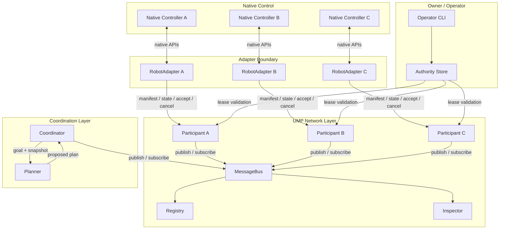

Universal Machine Protocol (UMP) is structured as a layered architecture that separates semantic awareness from native robot control. Every layer has a defined boundary, and no UMP component issues joint commands, motor values, gait instructions, or emergency stops. Native controllers retain full authority over physical execution.

## Boundary model

The `RobotAdapter` protocol is the hard boundary between UMP and native robot software. Only the native side may invoke navigation, manipulation, or actuator APIs. UMP communicates observations, intent, goals, plans, high-level assignments, and outcomes. The validator never turns a plan directly into motion. An assignment remains a request that the target adapter may reject.

```text
Reasoning provider -> proposed plan -> UMP validator -> assignments
                                                   |
Robot peers <- semantic state <- UMP participant <- adapter -> native controller
```

## Portable interfaces

UMP defines two primary Python protocols in the reference implementation:

- `RobotAdapter` exposes `manifest()`, `state()`, `accept()`, and `cancel()`. A simulation adapter and a physical robot adapter implement the same interface. Cancellation returns a native accepted or rejected decision; it is never treated as an actuator command or emergency stop.
- `Planner` accepts a `SharedGoal` and an immutable participant snapshot, then returns a `Plan`. The reference planner is deterministic; an AI model can replace it without changing adapters.

The manufacturer-facing contract lives in `ump.adapter` and is re-exported from `ump`. The planner contract lives in `ump.planner` and is also re-exported from `ump`.

## Transport bindings

UMP provides two transport bindings that preserve the same message and participant semantics:

- `InMemoryBus` is a deterministic development binding. It exercises envelope, registry, state, and collaboration semantics without claiming to be a production network protocol.
- `TlsNetworkBus` implements mutual TLS 1.3 with mandatory client certificates and certificate-to-envelope identity binding. Every binding passes bytes through the canonical codec before delivery, keeping tests honest about serialization, size limits, enum representation, and unknown data.

UDP discovery supplies expiring endpoint and certificate-fingerprint hints only. Trust is established by the subsequent TLS exchange, never by discovery.

## Full component topology



## Coordinator execution model

The coordinator is event-driven. It journals a validated plan and all stable assignment identifiers before publication, journals dispatch before delivery, and progresses dependencies only after durable successful outcomes. SQLite WAL storage provides restart-safe run and step state.

The coordinator accepts one goal or a bounded batch. Every proposal in a batch is validated before any run is journaled or published. Replanning is additive: a terminal plan remains immutable while a new plan receives a new identifier, an exactly incremented revision, and an explicit predecessor identifier.

A durable coordinator journal is permanently bound to one authenticated coordinator identity. This lets an owner restart the network process and request native cancellation for dispatched, accepted, or uncertain work without allowing a different identity to inherit cancellation authority.

## Registry and inspector

The `Registry` subscribes to `manifest` and `state` messages on the bus and maintains a `PeerView` for every authenticated robot. It enforces session ordering, replay rejection, and state freshness. A planner using a network-populated registry sees only context already authorized by disclosure policy for its participant identity.

The `Inspector` is a read-only operational view of recorded protocol traffic. It exposes robot manifests, current semantic state, capabilities, and a correlated event timeline. It has no endpoint or UI action for assignments, cancellation, authority changes, or native commands. A robot appears only after a running UMP node has published an authenticated manifest and semantic state that were recorded in the inspector database.

## Network profile

The mutual-TLS network profile enforces:

- TLS 1.3 minimum with mandatory client certificates
- Certificate-to-envelope identity binding via `urn:ump:robot:<robot-id>` URI SAN
- Replay protection with per-source-session sequence floors
- Durable inboxes and outboxes persisted across restarts
- Disclosure policy filtering per peer and message type
- Safety-stream prioritization with independent FIFO heads

For full network configuration details, see the [Delivery](/concepts/delivery) concept page and the [Authority](/concepts/authority) concept page for lease enforcement.