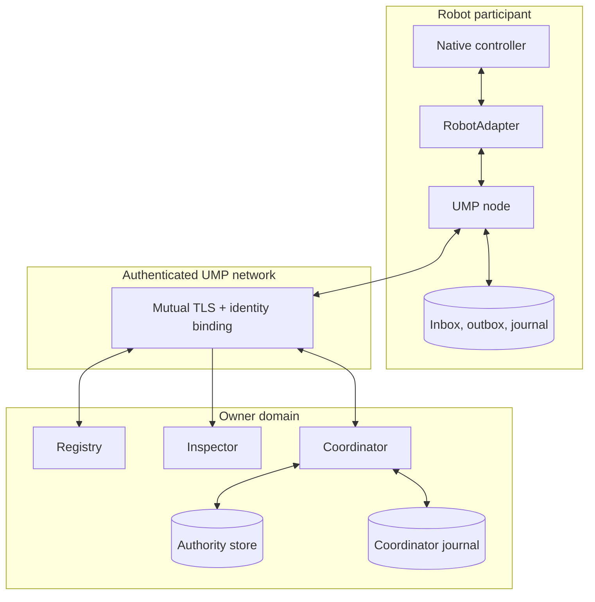

UMP separates observation, coordination, delivery, and native execution so each
boundary can be validated independently.



## Participant

A participant represents one robot or coordinator identity. It publishes
manifests and semantic state, receives allowed message types, enforces replay
and disclosure policies, and keeps durable delivery state.

## Manufacturer adapter

`RobotAdapter` is the only boundary between UMP coordination and manufacturer
software. It exposes:

```python
class RobotAdapter(Protocol):
    def manifest(self) -> RobotManifest: ...
    def state(self) -> RobotState: ...
    def accept(self, assignment: Assignment) -> Outcome: ...
    def cancel(self, assignment_id: str, reason: str) -> tuple[bool, str]: ...
```

The adapter translates semantics, not control algorithms.

## Registry and inspector

The registry holds the freshest accepted manifest and state for each identity.
Records expire when freshness bounds are exceeded. The inspector reads recorded
traffic and never synthesizes online status or missing telemetry.

## Coordinator

The coordinator validates goals and plans, checks authority, dispatches ready
steps, records outcomes, blocks failed dependencies, and reconciles unknown
work after restart. A reasoning model may propose a plan but cannot bypass plan
validation.

## Durable stores

Credentials, authority leases, assignments, inboxes, outboxes, and coordinator
state use separate durable ownership boundaries. Database path collisions fail
preflight instead of silently sharing state.
