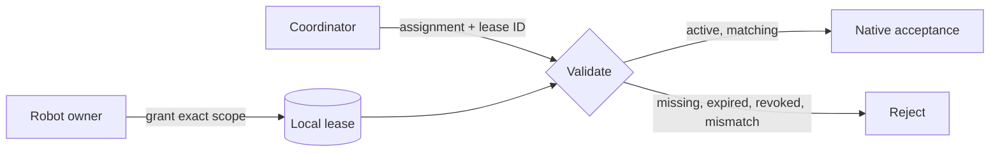

Authority is granted by the target robot owner and stored locally for that
robot. A lease binds a lease ID, issuer identity, capability, target robot,
validity window, and revision.



## Grant a lease

```bash
ump-authority --robot-id robot-mobile-1 \
  --database /var/lib/ump/authority.sqlite3 \
  grant --lease-id supervised-shift-a \
  --issuer-id warehouse-coordinator-1 \
  --capability ump.material.carry/v1 \
  --expires-at-ms 1800000000000
```

Use short validity windows and one exact capability. Revoke the lease when the
supervised session ends.

## Authorization requirements

An assignment is authorized only when robot, issuer, capability, lease ID,
lease revision, and effective time all match. Backdated messages cannot extend
an expired lease. Revocation is durable and audited.

<Warning>
  `AllowAllAuthorizer` exists for deterministic fixtures. Never use it for a
  networked or physical robot deployment.
</Warning>
