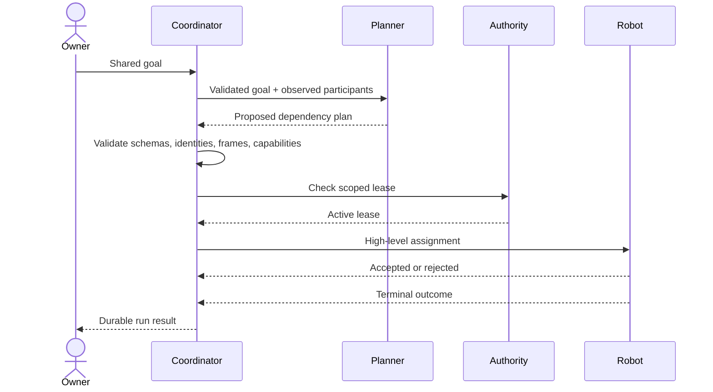

Collaboration separates what a user wants from what any one robot is asked to
accept.

## Lifecycle

## Shared goal

A goal defines the desired semantic outcome and eligible participants. It does
not prescribe joints, trajectories, or vendor commands.

## Plan

A plan contains versioned capability steps and dependencies. Only dependency-
ready steps may dispatch. Independent steps may execute concurrently when the
coordinator is explicitly configured for bounded concurrency.

## Assignment

An assignment binds one validated step to one robot, plan revision, issuer,
correlation identity, and authority lease. The target adapter still performs
native acceptance.

## Outcome

Terminal outcomes are `succeeded`, `failed`, `rejected`, `cancelled`, or
`unknown`. `Unknown` is used when execution may have occurred but UMP cannot
safely prove the terminal result. It must be reconciled, not retried blindly.

<Note>
  External reasoning providers produce proposed plans only. Provider output
  cannot become assignments until UMP validation succeeds.
</Note>
