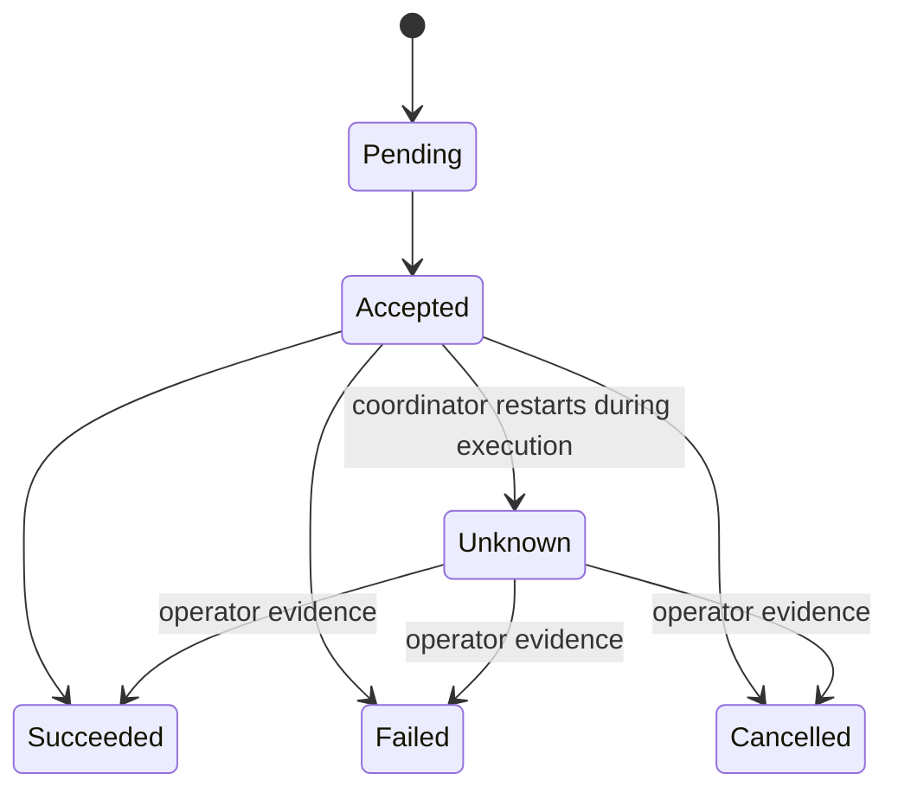

UMP separates transport acknowledgement from application outcome. Messages are
framed, authenticated, identity-bound, sequence-checked, and recorded durably.

## Delivery guarantees

- Per-peer FIFO delivery within each stream.
- Independent operational and safety sequence spaces.
- Idempotent exact retry.
- Conflict rejection when one message ID is reused with different content.
- Durable pending delivery across process restart.
- Bounded queues and reserved safety-stream capacity.

## Restart behavior

UMP does not redispatch work whose native outcome is unknown. An operator or
manufacturer status API must provide evidence before reconciliation.

## Communication loss

Adapters may implement `communication_lost()` and `communication_restored()`.
The callback informs the native policy that required semantic peers became
stale; it does not dictate how the robot should move or stop.
