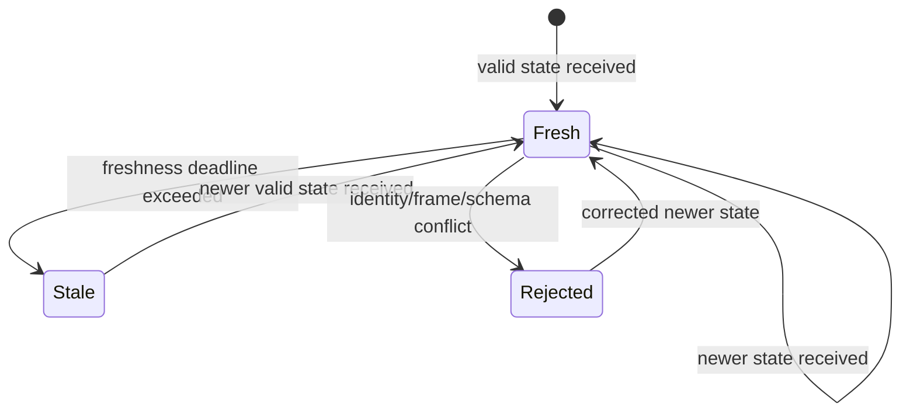

UMP awareness is a bounded semantic snapshot, not a raw sensor stream.

## Manifest versus state

| Record | Purpose | Typical change rate |
| --- | --- | --- |
| Manifest | Stable identity and current capability contracts | On startup or capability change |
| State | Current operational observation | Periodic, commonly 1-2 Hz |

A state may include mode, availability, activity, intent, progress, safety,
health, battery, pose, and observation timestamp. Optional data stays absent
when the native system cannot provide it.

<Warning>
  Never infer battery, health, safety, pose, intent, or progress from unrelated
  fields. “Unknown” is a valid and safer semantic result.
</Warning>

## Health and battery

Health uses `healthy`, `degraded`, `faulted`, or `unknown`. Battery includes a
bounded level and status such as `charging`, `discharging`, `full`,
`not_present`, or `unknown`. An absent battery is different from a reported
zero-percent battery.

## Pose, frames, and units

Spatial data is frame-qualified and uses SI units. A pose contains a frame ID,
position in meters, and quaternion orientation in `xyzw` order. Numeric
capability fields declare supported `x-ump-unit` values. Unknown frames reject
task mappings rather than being silently treated as a familiar frame.

## Freshness

Observation time describes when the source measured the state. Receipt time
describes when UMP recorded it. Freshness policies determine when a participant
becomes stale; stale state cannot be used as current evidence for planning or
assignment acceptance.

