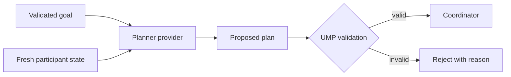

The planner converts a validated shared goal and observed participant context
into a proposed dependency plan. It does not dispatch work.

## Provider boundary

The deterministic planner is the reference provider. An external reasoning
model may be used only behind the validated provider interface.

## Plan validation

UMP checks:

- Stable participant and capability identities.
- Versioned input and output schemas.
- Required units and coordinate frames.
- Acyclic dependencies and immutable revision lineage.
- Capability availability and disclosure.
- Explicit external-task mappings where applicable.

Provider output remains a proposal until every check passes. Authority is
checked separately at assignment time.

## Operational recommendation

Record the provider identity, model or implementation version, prompt or policy
hash, input context hash, proposed plan, validation report, and final accepted
plan revision for every reasoning-assisted run.
