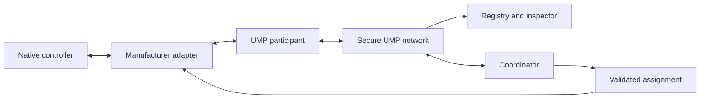

Universal Machine Protocol (UMP) lets robots from different manufacturers share
what they are doing and participate in validated, high-level collaborative work.

<Note>
  UMP is an alpha reference implementation. It is ready for integration
  development and software qualification, not universal hardware certification.
</Note>

## One protocol, native control

UMP shares identity, capabilities, activity, intent, progress, availability,
pose, safety, health, battery, and freshness. It never sends joint trajectories,
motor values, gait commands, or emergency-stop commands.

<Columns cols={3}>
  <Card title="Run the lab" icon="flask-conical" href="/quickstart/first-scenario">
    Prove the mixed-fleet workflow in five minutes.
  </Card>
  <Card title="Connect a robot" icon="bot" href="/build/manufacturer-adapter">
    Build a read-only manufacturer adapter first.
  </Card>
  <Card title="Understand readiness" icon="shield-check" href="/validate/hardware-readiness">
    Learn what software evidence proves and what it cannot prove.
  </Card>
</Columns>

## What you can build

- A local mutual-TLS awareness network for heterogeneous robots.
- A read-only operational view of observed robot state.
- Standards bridges for MassRobotics, VDA 5050, Open-RMF, ROS 2, and OPC UA.
- A coordinator that validates plans and issues bounded assignments under
  robot-owner authority leases.
- A qualification laboratory with deterministic emulators, real local
  middleware, fault injection, load profiles, Gazebo, and signed evidence.

## Choose your path

<Tabs>
  <Tab title="Evaluator">
    Start with [Install UMP](/quickstart/install), then run the
    [first scenario](/quickstart/first-scenario).
  </Tab>
  <Tab title="Robot engineer">
    Read the [safety boundary](/overview/safety-boundary), then implement a
    [manufacturer adapter](/build/manufacturer-adapter).
  </Tab>
  <Tab title="Fleet integrator">
    Review [architecture](/concepts/architecture),
    [standards integrations](/integrations/overview), and
    [production nodes](/build/production-node).
  </Tab>
  <Tab title="Safety or test lead">
    Begin with [hardware readiness](/validate/hardware-readiness) and the
    [supervised hardware gate](/validate/hardware-trials).
  </Tab>
</Tabs>
