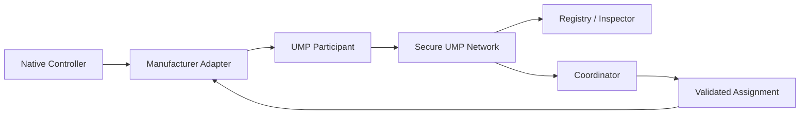

Universal Machine Protocol (UMP) is a manufacturer-neutral semantic layer that lets heterogeneous robots describe what they are, what they can do, what they are doing, and their current operational state using one bounded protocol. UMP carries shared goals and validated assignments, but it never controls joints, motors, navigation, manipulation, gait, or emergency stops. Every robot keeps its native controller, autonomy, acceptance checks, and safety system.

<Note>
  UMP is an **alpha reference implementation** (UMP 0.1). It is suitable for integration development and supervised hardware trials after the readiness gate passes. It is not a universal robot certification or a replacement for manufacturer safety controls.
</Note>

## Architecture

UMP sits between native robot controllers and a secure coordination network. Manufacturer adapters translate native state into UMP semantics, while a mutual-TLS network enforces identity, disclosure, and authority boundaries.

## What you can build

With UMP, you can create:

- **Local mTLS awareness networks** — observe heterogeneous robots in real time without exposing control surfaces
- **Read-only operational views** — inspect manifests, state, health, battery, and pose through the read-only inspector
- **Standards bridges** — connect MassRobotics, VDA 5050, Open-RMF, ROS 2, and OPC UA Robotics into a single semantic model
- **Coordinator-driven collaboration** — submit shared goals, receive deterministic plans, and track validated assignments
- **Qualification laboratories** — run mixed-fleet scenarios, fault profiles, load tests, and signed readiness reports

## Choose your path

<Tabs>
  <Tab title="Evaluator">
    Start with the [five-minute verification](/quickstart/first-scenario) to run the mixed-fleet lab, generate a signed readiness report, and verify protocol conformance. Then review the [safety boundary](/overview/safety-boundary) to understand what UMP does and does not control.
  </Tab>
  <Tab title="Robot Engineer">
    Begin with the [installation guide](/quickstart/install), then implement a read-only adapter from the manufacturer guide. Publish manifest and state before adding any high-level capabilities or accepting assignments.
  </Tab>
  <Tab title="Fleet Integrator">
    Generate a [local awareness network](/guides/local-network), configure mutual-TLS identities, and connect standards integrations. Use the coordinator to submit shared goals while enforcing authority leases and disclosure policy.
  </Tab>
</Tabs>

## Next steps

<CardGroup cols={3}>
  <Card title="Run the Lab" icon="flask-conical" href="/quickstart/first-scenario">
    Execute the mixed-fleet warehouse scenario and verify readiness in under five minutes.
  </Card>

  <Card title="Connect a Robot" icon="bot" href="/guides/manufacturer-adapter">
    Implement the RobotAdapter protocol and bind your native controller to UMP semantics.
  </Card>

  <Card title="Understand Readiness" icon="shield-check" href="/validate/hardware-readiness">
    Learn how signed reports, conformance vectors, and fault profiles qualify hardware trials.
  </Card>
</CardGroup>
