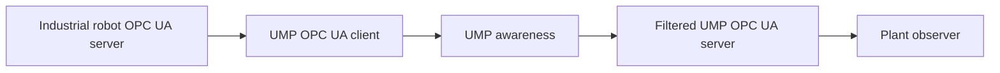

UMP supports two roles:

- **Client:** imports authorized identification, operating mode, health,
  battery, and semantic extension nodes from an industrial robot.
- **Server:** exposes filtered UMP identity, state, health, battery,
  capabilities, and assignment status without actuator methods.



```bash
python3 examples/standards_mapping_demo.py opc_ua
ump-integration runtime opc_ua
```

The live laboratory uses pinned `asyncua` for a real local server/client round
trip. Production endpoint security, trust lists, namespaces, and access policy
remain deployment-owned.
