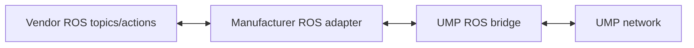

The ROS 2 integration publishes semantic manifest and state topics and exposes
a high-level assignment action. UMP core is not coupled to a single ROS
distribution.

The separately buildable interface package is located at
`ros2_interfaces/ump_interfaces` and defines awareness messages and the
`ExecuteCapability` action.

## Recommended adapter pattern



Do not expose low-level velocity, trajectory, joint, or emergency interfaces as
UMP assignments. Translate one reviewed high-level vendor action at a time.

```bash
python3 examples/standards_mapping_demo.py ros2
ump-integration runtime ros2
```

The Docker ROS 2 profile proves a real `/ump/lab/semantic_state` publish and
subscribe path under ROS 2 Jazzy.
