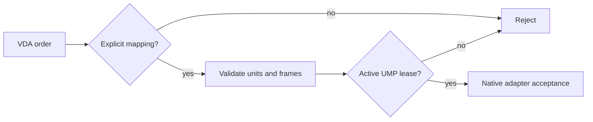

UMP supports versioned VDA 5050 MQTT topics, factsheets, state, visualization,
instant actions, and orders while leaving route execution and AGV safety native.

## Awareness mapping

Factsheets and state can provide identity, pose, battery, safety, errors,
operating state, and order identity. UMP preserves version, manufacturer,
serial number, timestamps, map identity, and units where semantics align.

## Order mapping



Read-only is the default. Never infer an executable UMP capability from a VDA
action name alone.

```bash
python3 examples/standards_mapping_demo.py vda5050
ump-integration runtime vda5050
```

The live lab uses pinned `paho-mqtt` and a local Mosquitto broker.
