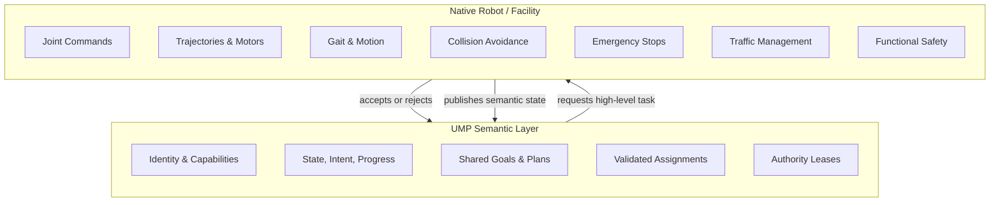

UMP is a semantic coordination layer, not a robot controller. It exchanges observations, intent, goals, plans, and high-level assignments between heterogeneous robots. A manufacturer adapter acts as the hard boundary between UMP and native robot software. Only the native side may invoke navigation, manipulation, or actuator APIs. This page clarifies what UMP does and does not do so you can integrate safely and correctly.

## UMP vs native responsibilities

## UMP does

UMP provides the shared semantic contract that lets robots collaborate without sharing native control stacks:

- **Identity and capabilities** — every robot publishes a manifest describing who it is and what high-level capabilities it advertises
- **Operational state** — current activity, intent, progress, availability, health, battery, and safety condition
- **Spatial awareness** — named-frame poses with SI-meter positions and normalized quaternions; up to 32 metadata-only sensor references per state message
- **Shared goals and planning** — coordinators submit goals, planners propose high-level plans, and UMP validates dependencies, capability matching, and authority leases
- **Validated assignments** — a coordinator requests one advertised high-level capability; the target adapter may accept or reject it
- **Authority leases** — the robot owner grants scoped, time-bounded authority to a specific issuer for specific capabilities; the participant validates every assignment against its local lease store
- **Cancellation requests** — a coordinator can request cancellation of an active plan; the native adapter decides whether to accept or reject
- **Read-only inspection** — the inspector displays only recorded UMP traffic, never inventing robots or telemetry

## UMP does not

UMP never replaces native autonomy, safety systems, or physical controls. Specifically, UMP does not:

- Send joint commands, trajectories, or motor values
- Issue gait commands or motion primitives
- Trigger emergency stops or safety-rated stop mechanisms
- Replace native autonomy, path planning, or collision avoidance
- Manage facility traffic, doors, lifts, or building maps
- Assume functional-safety certification or manufacturer endorsement
- Guess missing telemetry; unknown fields remain `unknown` or `null`

The native controller retains full authority over acceptance, execution, cancellation, and all physical safety behavior. UMP cancellation is a task-coordination operation, not an emergency stop, and must never bypass local controllers.

## What this means for integration

When you connect a robot to UMP, start read-only: implement `manifest()` and `state()` with no advertised capabilities and reject all assignments. Compare live identity, timestamps, units, frames, health, battery, safety, and freshness against your native tools. Only after this baseline is verified should you add one bounded high-level capability, grant a short authority lease, and conduct the first supervised physical assignment with functioning emergency stops.