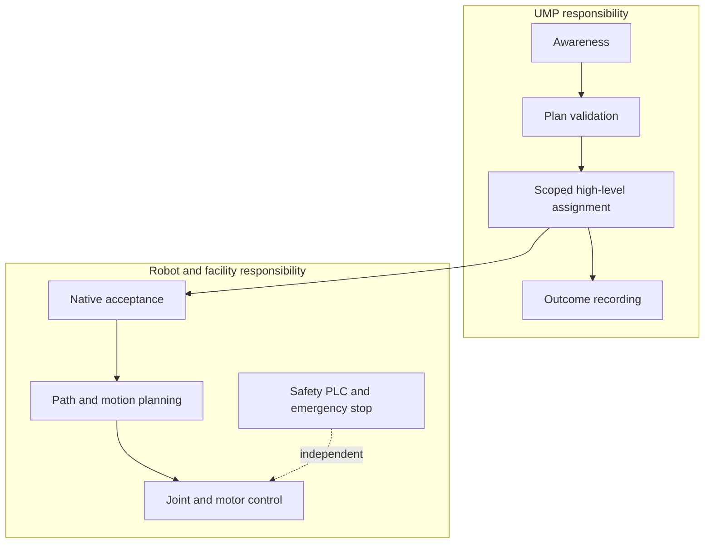

UMP is a semantic coordination layer. It does not replace robot autonomy,
traffic management, functional safety, or physical emergency controls.

## UMP does

- Describe identity, capabilities, state, intent, progress, health, battery,
  safety state, pose, units, frames, and timestamps.
- Validate shared goals and proposed plans.
- Require explicit capability mappings and authority leases.
- Deliver bounded, high-level assignments to a robot adapter.
- Preserve native rejection, cancellation, and terminal outcomes.

## UMP does not

- Generate joint trajectories, velocity commands, or actuator values.
- Override operating modes, protective stops, emergency stops, or safety PLCs.
- Replace Open-RMF traffic and facility scheduling.
- Guess missing telemetry or silently translate unsupported commands.
- Certify a manufacturer adapter, firmware release, or physical workcell.

<Warning>
  UMP cancellation is a high-level request. It must never be treated as an
  emergency stop or a functional-safety control.
</Warning>

## Failure behavior

The system fails closed. Missing mappings, expired leases, stale state, unknown
frames, unsupported units, conflicting identities, unsafe state, degraded
health, or native rejection prevent assignment execution.
