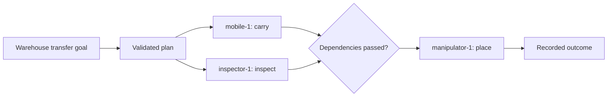

The reference workflow has three independent robot controllers:

1. `mobile-1` transports a payload to a workcell.
2. `inspector-1` inspects the destination and reports readiness.
3. `manipulator-1` places the payload after both dependencies succeed.



<Steps>
  <Step title="Run the scenario">
    ```bash
    ump-lab run --output .ump-lab/scenario.json
    ```

    Look for `"passed": true` and three `"succeeded"` step statuses.
  </Step>
  <Step title="Generate evidence">
    ```bash
    ump-readiness report --output .ump-lab/readiness.json
    ```
  </Step>
  <Step title="Verify the signature and checksums">
    ```bash
    ump-readiness verify .ump-lab/readiness.json
    ```

    A valid report returns `"valid": true`.
  </Step>
</Steps>

## What just happened

Each controller exposed a manifest and semantic state through `RobotAdapter`.
The planner produced dependency-ordered high-level steps. UMP validated each
step, checked a robot-local capability lease, and asked the native-style
controller to accept it. The controller remained authoritative for execution
and final outcome.

## What this does not prove

This scenario is deterministic and process-local. It does not prove live
middleware, network behavior, Gazebo loading, vendor SDK compatibility, or
physical safety. Continue to the [Docker lab](/quickstart/docker-lab) for those
software boundaries.
