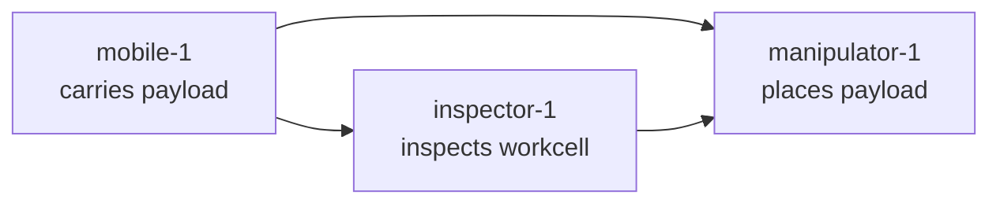

The UMP mixed-fleet warehouse scenario demonstrates deterministic collaboration across three independent robot emulators. In this scenario, `mobile-1` transports a payload to a workcell, `inspector-1` verifies the destination is ready, and `manipulator-1` places the payload only after both dependencies succeed. Every assignment passes through plan validation, a scoped authority lease, the adapter boundary, and native-style acceptance. This proves the deterministic software path in under five minutes.

## Scenario workflow



The manipulator waits for both the mobile robot and the inspector to succeed before it begins. If either dependency fails or becomes unknown, the placement step is blocked.

## Run the scenario

<Steps>
  <Step title="Run the lab scenario">
    Execute the deterministic mixed-fleet scenario and save the outcome:

    ```bash
    ump-lab run --output .ump-lab/scenario.json
    ```

    Expected result: `"passed": true` in the scenario output.
  </Step>
  <Step title="Generate a readiness report">
    Create a signed machine-readable report containing runtime versions, configuration hashes, scenario outcomes, delivery metrics, fault outcomes, mapping warnings, and artifact checksums:

    ```bash
    ump-readiness report --output .ump-lab/readiness.json
    ```

    Without `--signing-key`, UMP uses an ephemeral Ed25519 key. This proves report integrity, not operator identity. For release or hardware trials, supply an owner-controlled key.
  </Step>
  <Step title="Verify the report">
    Validate the signature and report contents:

    ```bash
    ump-readiness verify .ump-lab/readiness.json
    ```

    Expected result: `"valid": true`.
  </Step>
</Steps>

## What this proves

Passing the scenario and readiness verification demonstrates:

- The deterministic software path from plan validation through authority lease, adapter boundary, and native-style acceptance
- Protocol envelope encoding, schema validation, and dependency progression
- Durable coordinator dispatch and outcome recording
- Correct behavior across three independent controller emulators

<Note>
  Passing this scenario proves **protocol compatibility through the full path**: plan validation, authority lease, adapter boundary, and native-style acceptance. It does **not** prove physical compatibility with your hardware. Physical trials require a separate supervised qualification process.
</Note>

## Run all tests

After the scenario passes, run the complete test and conformance suite to confirm full compatibility:

### Python unit and integration tests

```bash
python3 -m unittest discover -s tests -v
```

### Protocol conformance vectors

```bash
ump-conformance conformance/v0.1
```

The conformance suite validates encoding, size bounds, identity matching, session ordering, replay rejection, state freshness, plan capability matching, dependency validation, input-schema validation, and duplicate assignment handling. Exit status `0` means every check passed.

## Next steps

- Review the [safety boundary](/overview/safety-boundary) to understand what UMP does and does not control
- Learn how to [connect a real robot](/guides/manufacturer-adapter) by implementing the `RobotAdapter` protocol
- Explore [hardware readiness](/validate/hardware-readiness) for the full qualification gate before physical trials